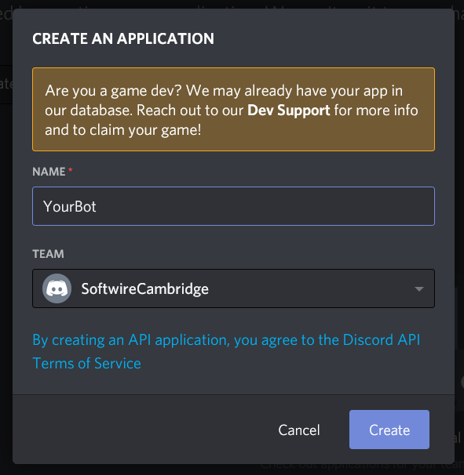
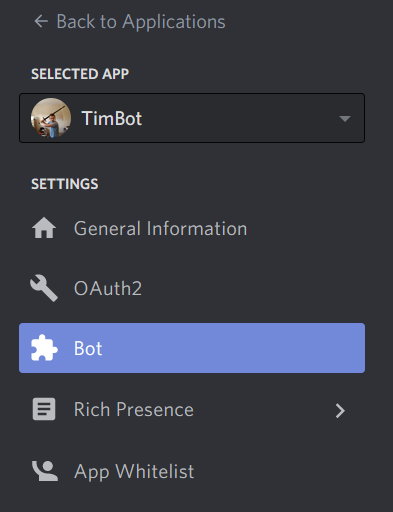
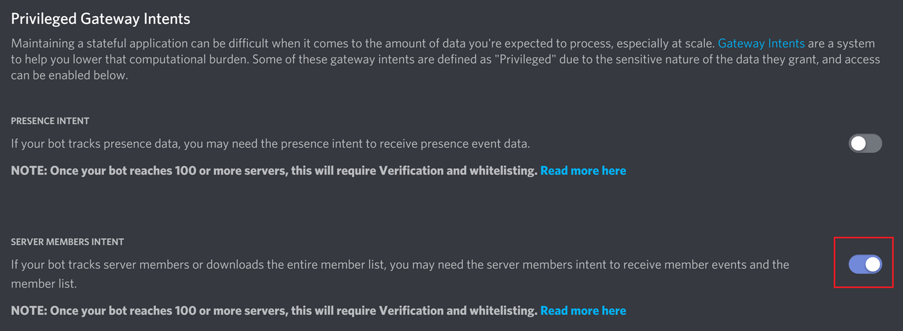

# Softwire Morale Event Discord Bot

This Discord bot makes it easier for morale event admins to organise events, and for people to sign up to those events.
It links up with Google Sheets to generate an at-a-glance list of all the events happening, and has other features to make this all easier.

The main branch currently publishes to the live bot "ReleaseBot". Once you've joined the Discord Developer team you'll 
have the ability to add the bot to a server in which you have the "Manage Server" or Admin permissions. 
`?help` will show you the commands the bot currently has and you can do `?help [command] [optional: subcommands]` for more information.

## Useful links

* [DSharpPLus API](https://dsharpplus.github.io/)
* [Discord Developer Portal](https://discord.com/developers/applications)
* [Google Sheets API](https://developers.google.com/sheets/api/quickstart/dotnet)
* [Google Sheets .NET Client source](https://github.com/googleapis/google-api-dotnet-client/blob/master/Src/Generated/Google.Apis.Sheets.v4/Google.Apis.Sheets.v4.cs)
(for when the API docs don't explain how to do something using the .NET client)

## TODO List

### Initial Setup

- [x] Set up Discord Developer Team
- [x] Set up Google Sheets API Account
- [x] Set up Shared Azure Account
- [x] Set up Zoho Vault
- [x] Create Discord bots (for both testing and release)
- [x] Get Azure deployment working
- [x] Set up continuous integration on main branch
- [x] Set up build testing on all branches
- [x] Create basic bot skeleton with DSharpPlus and test it works

### Core Features

- [x] Set up interactivity with discord bot
- [x] Event creation conversation with discord bot
- [x] Event creation integrated with Google sheets
- [x] Event removal conversation with discord bot
- [x] Event removal integrated with Google sheets
- [x] Event editing conversation with discord bot
- [x] Event editing integrated with Google sheets
- [x] Listing all events with discord bot conversation
- [x] Showing specific events with discord bot conversation
- [x] Set up Sign up sheet in Google sheets
- [x] Create signup/start event command with discord bot conversation
- [x] Allow people to signup using reactions
- [x] Set up user Direct Messaging on signup
- [x] Group commands to allow bypassing of full conversation with bot
- [x] Remove event signup form on event removal
- [x] Allow people to unsign from events
- [x] Hard code in response sets for events
- [x] Make bot post events in separate channel
- [x] Use a Discord role to control who can issue bot commands
- [ ] Notify users that their event is going to start
- [ ] Allow admins to forcibly sign people up to events with the discord bot
- [ ] Allow creation of recurring events
- [ ] Add handling for multiple timezones (eg. Budapest and London)

### Complications that need to be addressed

- [x] Migrate from DSharpPLus 3.x to 4.x 
- [x] Batch Google sheet API requests to avoid hitting the 100 requests per 100s limit
- [ ] Implement some sort of job scheduling for notifications (maybe using [Quartz Scheduler](https://www.quartz-scheduler.net/))

### Stretch Goals

- [ ] Allow the creation of custom response sets with the bot
- [ ] Notify users if the event they signed up to has changed
- [ ] Switch from using Google Sheets to a database with transactions, ACID properties, no API quotas, etc.
- [ ] Allow users to disable bot reminder notifications
- [ ] Add pagination to event lists (limit 5 per page)
 
## Setup

### Creating a bot for local testing

1. Have someone on the team add you to the SoftwireCambridge Discord developer team
2. Go to https://discord.com/developers/applications and click "New Application" in the top right
3. Name your local testing bot, making sure that the team is set to SoftwireCambridge


### Getting Google Sheets credentials

1. Add yourself as an editor to the softwire-discord-bot project on Google Cloud Platform, or get someone else who is an
editor to follow the subsequent steps.
    1. Login into the "Google Developers Project Manager" account (in the Zoho chamber)
    2. In IAM & Admin -> IAM, add your Google account as an editor
2. In IAM & Admin -> Service accounts, create a new service account
    1. Name the account with some reference to your name ideally
    2. Don't give it any access, roles, or give users special access (so just click continue and done)
3. Click on your newly made service account, and add a key (Add key -> create new key -> JSON -> Create)
4. A JSON credentials file will download. You will need this to run the bot locally.
5. Create a Google Sheet of the right format (easiest just to copy someone else's test sheet)
6. Add the email address of your service account as an editor to this sheet using the Google Sheets "Share"
functionality.
7. You need to find the spreadsheet ID of the sheet you made. At the moment, this is easiest extracted from the URL
of the webpage of the Google Sheets editor, but this might be different in the future so Google it. Currently,
that URL is of the form: `https://docs.google.com/spreadsheets/d/{spreadSheetId}/edit`, where `{spreadSheetId}` is
you spreadsheet ID. Note this, you will need it to run the bot locally.
8. Done! You should be able to see the changes made by the bot to the sheet using the Google Sheets website.

### Running the bot locally

1. A few things need to be passed in as environment variables when you run locally. These are:
```
// Found on Discord for developers
RELEASE_BOT_TOKEN

// Found from the URL of your sheet, found when getting Google Sheets credentials
GOOGLE_SHEET_ID

// Found in the JSON file that you downloaded when getting Google Sheets credentials
GOOGLE_CLIENT_EMAIL
GOOGLE_PROJECT_ID
GOOGLE_PRIVATE_KEY_ID
GOOGLE_PRIVATE_KEY
```

There is a template launchSettings.json.copy file in "DiscordBot/Properties/ServiceDependencies/", all you need to do is 
duplicate this file and remove ".copy" from it.

2. With your bot selected in Discord for developers, go to "Bot" on the left

3. You will need to give the bot the "Server members intent" under "Privileged Gateway Intents" to give it access to member events.

4. Copy the token on this page and pass it into your launchSettings.json as `RELEASE_BOT_TOKEN`
5. Pass in the `GOOGLE_SHEET_ID` and the four relevant fields in the JSON from Zoho
6. On the Discord developer page, select your app and go to "OAuth2", from here select "bot" and any permissions you want
the bot to have. Copy the generated link and paste it into your browser to add the bot to your testing server.

7. Run!
8. You will need to create and add a role name "Bot Whisperer" in your discord server and give that role to anyone that needs to use `?event` commands.

You should now be able to interact with your bot in the Discord server. Try saying `?event`!
